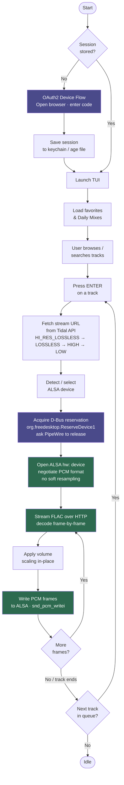

# Architecture

## How it works

## Audio pipeline

1. **Stream URL** — The Tidal API is queried for a FLAC stream URL, trying quality tiers from highest to lowest (`HI_RES_LOSSLESS`, `LOSSLESS`, `HIGH`, `LOW`).
2. **FLAC decode** — Frames are decoded in-flight from the HTTP response body using `github.com/mewkiz/flac`. No temporary files, no buffering to disk.
3. **Format negotiation** — The ALSA `hw:` device is opened with the low-level `snd_pcm_hw_params` API (not the convenience wrapper). For 16-bit sources the preference order is `S16_LE → S24_3LE → S24_LE → S32_LE`; for 24-bit sources `S24_3LE → S24_LE → S32_LE`. Soft resampling is disabled via an explicit `snd_pcm_hw_params_set_rate_resample(..., 0)` — the sample rate must match the stream exactly. On a `hw:` device there is no plug layer to resample, so the call changes nothing in practice; it is made anyway so the bit-perfect contract is stated in the code rather than resting on an ALSA default. Plug-layer devices (`plughw:`, `default`) pass `1` instead, because resampling is the job they exist to do.
   - **Shared output** — Selecting `default` in the device picker switches to the shared PCM: ALSA resolves it through its own config, normally to the PipeWire or PulseAudio plugin. The sound server keeps the card, so other applications keep playing. The ReserveDevice1 handshake in step 7 is skipped entirely — it exists to push that server aside, and running it here would tear down the thing rendering the audio — and `default` carries no card number to parse in the first place. The ring buffer is widened from 4 periods to 8, because the server's own graph scheduling now sits underneath ours and 4 leaves too little slack. `alsaHandle.bitPerfect` is false, and the badge reads `(shared)` rather than `(converted)`: the user chose this path, they were not downgraded onto it.
   - **`plughw:` fallback** — Some USB interfaces (e.g. Focusrite's Vocaster line) expose a fixed native channel count, rate, and format on their `hw:` endpoint and refuse anything else. Because the C helper splits `open_hw_device` from `configure_hw_pcm`, this refusal is distinguishable from a device that is merely busy: only a `configure_hw_pcm` failure (tagged `errFormatRefused`) retries through ALSA's plug layer, which resamples and remixes to the hardware's shape. This forfeits bit-perfect output, so `alsaHandle.bitPerfect` is set false and surfaced through `Player.AudioPath` to the now-playing bar, which then shows the `plughw:` device and marks the quality badge `(converted)`. A busy device fails at the open step instead, keeps the existing `-EBUSY` retry against `hw:`, and is never downgraded. The result is memoised per device so pause/resume and gapless transitions skip the known-failing `hw:` open.
4. **PCM packing** — Samples are packed into the negotiated format with correct sign extension before being written to ALSA.
5. **Track transitions** — When a track's decoder reaches EOF its frames are queued but not yet played, so the playback loop calls `snd_pcm_drain` to let the DAC consume the tail. Skipping this lets the buffer empty on its own, which under-runs the PCM into XRUN and makes the next track's first `snd_pcm_writei` return `-EPIPE` — an audible click and a clipped opening on every auto-advance. Drain rather than drop, because drop discards the tail and breaks gaplessness. Drain leaves the PCM in `SETUP`, so a same-format transition — which deliberately keeps the device open instead of reopening it — calls `snd_pcm_prepare` before writing the next track. A format change reopens the device and needs neither.
6. **Xrun recovery** — Underruns that happen mid-track anyway (CPU or I/O starvation) are recovered automatically via `snd_pcm_recover`.
7. **PipeWire handoff** — Before opening the `hw:` device, the app acquires `org.freedesktop.ReserveDevice1.Audio{N}` on D-Bus. If PipeWire currently owns the device it is asked to release via `RequestRelease`. The reservation is held for the duration of playback and released on stop. `reserveUnlessShared` gates this: the shared PCM returns a no-op release func and never touches D-Bus.

## Package overview

| Package | Description |
|---------|-------------|
| `cmd/tidalt` | Entry point. Subcommands: TUI, `daemon`, `play`, `setup`, `setup --daemon`. Session load/restore, OAuth2 device-flow login. |
| `internal/tidal` | Tidal API client. OAuth2 auth, token refresh, REST calls (favorites, search, stream URL, mixes, radio, artist albums/top-tracks/all-tracks). See [Daily Mixes](#daily-mixes) for the endpoints the mix views use. |
| `internal/player` | Bit-perfect playback via CGO. FFmpeg (libav*) demuxes/decodes the stream; libasound plays it. Direct ALSA `hw:` access, PCM format negotiation, `plughw:` fallback for fixed-format devices, shared (`default`) output mode, PipeWire reservation, seek. |
| `internal/store` | Persistent storage. OAuth2 session in system keychain (falls back to age-encrypted file). Volume, device, position, theme, and track cache in bbolt. |
| `internal/ui` | BubbleTea TUI. A sidebar + main-pane layout: sections for Queue (with the hovered track's cover art), Playlists, Favorites (songs/artists/albums), Recently Played, Daily Mixes, Search, and Themes; overlays for the command palette, contextual action sheet, device select, and add-to-playlist; a centralized palette/theme system with a live-preview picker; a hybrid queue/playlist model. Runs headless in daemon mode. See [ui.md](ui.md). |
| `internal/mpris` | MPRIS2 D-Bus server + client. Media-key commands, `io.tidalt.App` private interface for client↔server communication. |

## Daily Mixes

Daily Mixes are read from the **v1** API:

| Call | Endpoint |
|------|----------|
| `GetMixes` | `GET /v1/pages/my_collection_my_mixes` |
| `GetMixTracks` | `GET /v1/mixes/{mixId}/items` |

Earlier releases used the v2 JSON:API endpoints
(`openapi.tidal.com/v2/userRecommendations/me/relationships/myMixes` and
`/v2/playlists/{id}/relationships/items`). Tidal removed the
`userRecommendations` resource, which now returns `404 NOT_FOUND` for every
request — that is what made the Daily Mixes view come up empty.

Two properties of the v1 endpoints are worth knowing:

- `/v1/mixes/{mixId}/items` returns **fully populated tracks** — artist and
  album included — in a single request. The v2 relationship returned bare IDs,
  which forced one `/v1/tracks/{id}` lookup per track; that fan-out is gone.
- Video mixes (`mixType` containing `VIDEO`, e.g. `VIDEO_DAILY_MIX`) are
  filtered out of the mix list, and any item whose `type` is not `track` is
  dropped from a mix's items. Their contents are videos, which the player
  cannot decode.

## Dependencies

| Library | Purpose |
|---------|---------|
| [charmbracelet/bubbletea](https://github.com/charmbracelet/bubbletea) | TUI framework |
| [charmbracelet/bubbles](https://github.com/charmbracelet/bubbles) | Progress bar, text input |
| [charmbracelet/lipgloss](https://github.com/charmbracelet/lipgloss) | Terminal styling |
| [godbus/dbus](https://github.com/godbus/dbus) | D-Bus (PipeWire reservation + MPRIS2) |
| [docker/secrets-engine](https://github.com/docker/secrets-engine) | Secure credential storage |
| [go.etcd.io/bbolt](https://go.etcd.io/bbolt) | Local settings & track metadata cache |
| libasound (CGO) | Direct ALSA `hw:` playback |
| FFmpeg — libavformat/libavcodec/libswresample (CGO) | Demux/decode the streamed audio (FLAC, AAC/mp4, ALAC) and resample to S32LE. Linked dynamically for local/dev builds; the official distro packages bundle a minimal static FFmpeg. |
